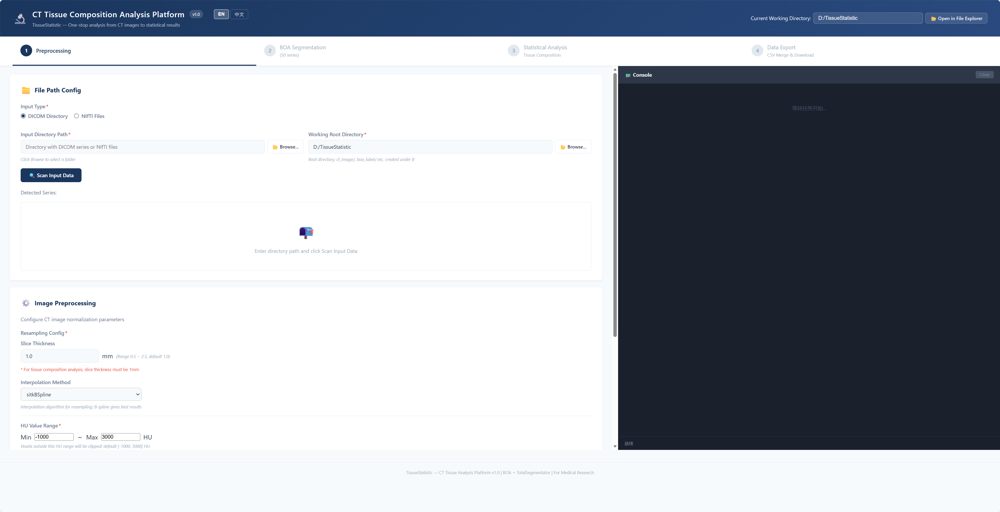

# TissueStatistic — CT组织成分统计分析平台



从CT图像中分割软组织成分并生成统计结果的综合平台。

## 功能特性

- **CT预处理**：支持 DICOM / NIfTI 输入；HU值裁剪、重采样、可选高斯模糊
- **BOA分割**：基于 [TotalSegmentator](https://arxiv.org/abs/2208.05868) 与 [Body Organ Analysis](https://pubmed.ncbi.nlm.nih.gov/32945971/) 模型，输出椎体、BCA、组织标签
- **统计分析**：7种组织（MUSCLE/BONE/SAT/VAT/IMAT/PAT/EAT）× 8项指标（体积、最大/最小/均值/标准差/中位数/Q1/Q3 HU值），覆盖 C2–L5 椎体
- **Web界面**：4步向导（预处理 → 分割 → 分析 → 导出CSV），右侧实时控制台

## 项目结构

```
├── pipline/                 # 核心管线脚本
│   ├── preprocess/          # DICOM/NIfTI 预处理
│   ├── statistic/           # 组织分析函数库
│   ├── utils/               # 图像读写与处理
│   ├── main_statistic_parallel.py  # 并行批量分析
│   └── environment.yml      # Conda 环境配置
├── html/                    # Web 应用 (FastAPI + 原生JS)
│   ├── app.py               # 入口
│   ├── api/                 # REST 端点
│   ├── wrappers/            # 管线包装器
│   ├── tasks/               # 任务管理器
│   └── templates/           # 前端 (index.html)
└── boa/                     # BOA 工具文档
```

## 快速开始

### 1. 环境搭建

```bash
conda env create -f pipline/environment.yml
conda activate boa
```

### 2. 启动 Web 应用

```bash
cd html
python -m uvicorn app:app --host 127.0.0.1 --port 8000
```

Windows 下可直接双击 `run.bat` 启动。

访问 `http://localhost:8000` 使用4步向导。

### 3. 命令行使用

```bash
# 批量统计分析所有患者
python pipline/main_statistic_parallel.py -b /path/to/data --workers 8
```

## 分析类型

| 类型 | 说明 |
|------|------|
| **全图分析 (ALL)** | 分析CT图像中所有层面的组织成分 |
| **椎体 + 范围** | 以指定椎体（C2–L5）为中心，分析某毫米范围内的组织成分 |

## 环境要求

- Python 3.10
- CUDA 12.1（推荐 ≥16 GB 显存的 GPU）
- Conda 虚拟环境 `boa`

## 参考文献

- BOA: [Haubold et al., Investigative Radiology, 2023](https://journals.lww.com/investigativeradiology/abstract/9900/boa__a_ct_based_body_and_organ_analysis_for.176.aspx)
- TotalSegmentator: [Wasserthal et al., Radiol. Artif. Intell., 2023](https://pubs.rsna.org/doi/10.1148/ryai.230024)
- nnU-Net: [Isensee et al., Nat. Methods, 2021](https://www.nature.com/articles/s41592-020-01008-z)

## 许可证

本项目用于学术研究，如用于科研请引用上述论文。
