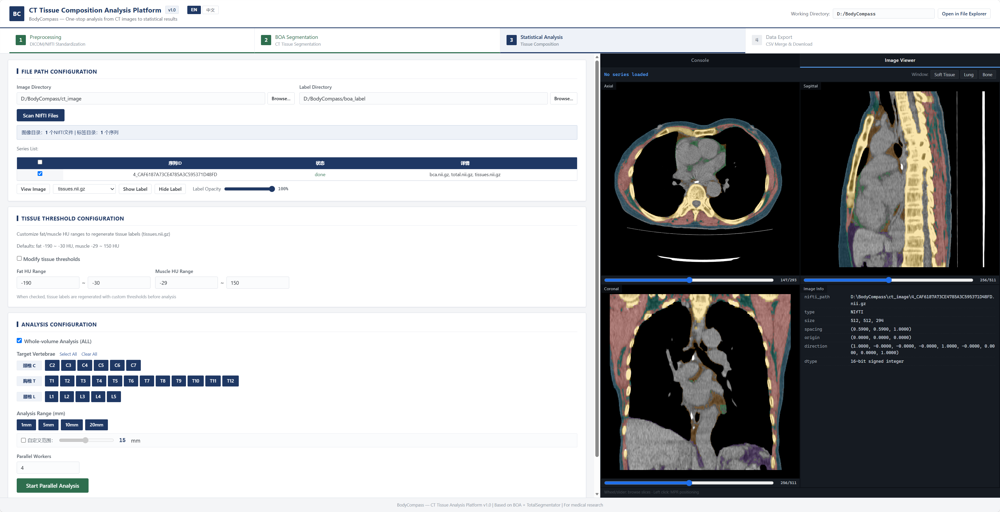

# BodyCompass v1.2



一体化可交互 CT 组织成分分析平台：从原始 DICOM/NIfTI 图像到统计 CSV 报告，内置基于 cornerstone.js 的 MPR 图像浏览器。

## v1.2 更新内容

- **新增分析模式**：两个锥体间范围分析（如 T1–T12），支持添加多组范围
- **界面优化**：分析方式命名更准确（全层面/单个锥体/两个锥体间）
- **默认值调整**：组织阈值设定默认勾选；预处理 HU 最大值调整为 1000；高斯模糊默认启用（Sigma 0.5）

## 功能特性

- **数据预处理**：支持 DICOM / NIfTI 输入；重采样（0.5–2.5 mm）、HU 裁剪、可选高斯模糊
- **BOA 分割**：在 `boa` conda 环境中运行项目内置的 Body-and-Organ-Analysis 代码（`boa/`），输出椎体（total）、BCA 与组织标签；支持中途停止分割（自动删除最后一个不完整的分割结果）
- **统计分析**：7 种组织（MUSCLE / BONE / SAT / VAT / IMAT / PAT / EAT）× 8 项指标（体积、最大/最小/均值/标准差/中位数/Q1/Q3 HU），支持全图与逐椎体（C2–L5）范围分析，并行处理
- **数据导出**：合并各序列 CSV 为综合表格，在侧栏预览并下载
- **图像浏览**（cornerstone.js，2×2 布局）：
  - 轴位 / 矢状位 / 冠状位 + 第四窗口：步骤1–2 显示图像信息，步骤3 显示椎体定位矢状位
  - 滚轮与各视图独立滑块浏览层面；左键点击 MPR 联动定位
  - 软组织窗 / 肺窗 / 骨窗预设
  - 标签叠加显示：不同标签不同颜色，透明度 1–100% 可调
  - 椎体定位：矢状位上以蓝色 1 体素细线显示各椎体中心层面（与统计分析相同的质心定位方法），左侧叠加椎体名称标签；距序列起始/末尾小于 10mm 的椎体自动过滤

## 项目结构

```
├── pipline/          # 核心管线（preprocess / statistic / utils）
├── html/             # Web 应用（FastAPI 后端 + 原生 JS 前端）
│   ├── api/          # REST 端点（preprocess / boa / analysis / merge / viewer）
│   ├── wrappers/     # 管线包装器
│   ├── tasks/        # 后台任务管理器（SSE 实时进度）
│   ├── static/       # CSS / JS / 内置 cornerstone 打包文件
│   └── templates/    # index.html
├── boa/              # 内置 Body-and-Organ-Analysis 代码（BOA 命令行）
└── run.bat           # Windows 启动脚本（激活 conda 环境 boa）
```

工作目录结构（顶部栏设置）：

```
<work_dir>/
├── ct_image/         # 预处理后的 NIfTI（{序列}.nii.gz）
├── boa_label/        # 各序列的分割标签
└── statistic/        # 各序列的统计 CSV
```

## 快速开始

```bash
# 1. 创建 conda 环境（仅首次）
conda env create -f pipline/environment.yml
conda activate boa
```

```bash
# 2. 启动服务（二选一）：
#    方式 A（Windows）：双击 run.bat
#    方式 B（命令行）：
cd html
python -m uvicorn app:app --host 127.0.0.1 --port 8000
```

访问 `http://localhost:8000`，按 4 步向导操作：数据预处理 → BOA 分割 → 统计分析 → 数据导出。右侧面板可在控制台、图像浏览、数据表格之间切换。

## 环境要求

- Python 3.10，conda 环境 `boa`
- 分割步骤建议配备 ≥16 GB 显存的 CUDA GPU

## 参考文献

- BOA: [Haubold et al., Investigative Radiology, 2023](https://journals.lww.com/investigativeradiology/abstract/9900/boa__a_ct_based_body_and_organ_analysis_for.176.aspx)
- TotalSegmentator: [Wasserthal et al., Radiol. Artif. Intell., 2023](https://pubs.rsna.org/doi/10.1148/ryai.230024)
- nnU-Net: [Isensee et al., Nat. Methods, 2021](https://www.nature.com/articles/s41592-020-01008-z)

## 许可证

Copyright (c) 2026 wuzhifa

Licensed under the Apache License, Version 2.0 (the "License");
you may not use this file except in compliance with the License.
You may obtain a copy of the License at

    http://www.apache.org/licenses/LICENSE-2.0

Unless required by applicable law or agreed to in writing, software
distributed under the License is distributed on an "AS IS" BASIS,
WITHOUT WARRANTIES OR CONDITIONS OF ANY KIND, either express or implied.
See the License for the specific language governing permissions and
limitations under the License.

本仓库包含内置的第三方 BOA（Body-and-Organ-Analysis）代码（`boa/` 目录），其各自的版权与许可请以对应上游项目为准。
